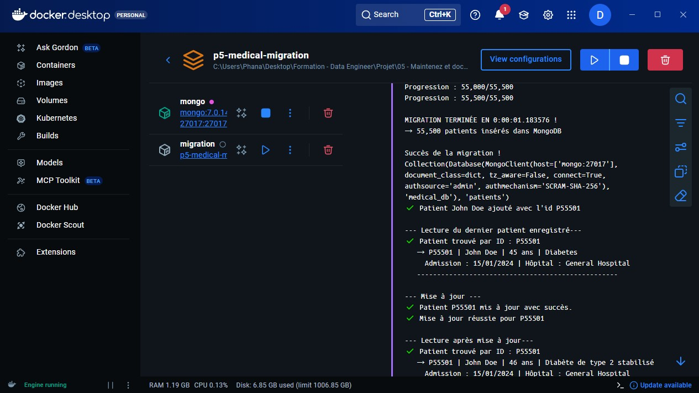

# Medical Data Migration – Étape 1 : MongoDB local sécurisé

Projet réalisé dans le cadre de mon stage Data Engineer chez **DataSoluTech**  
Objectif : installer MongoDB en local de façon propre, sécurisée et reproductible avec Docker, puis mettre en place un système d’authentification complet avec rôles dédiés.

## Prérequis 

### 1. Visual Studio Code
- Téléchargement : https://code.visualstudio.com/
- Extensions utiles installées :
  - Python

### 2. Docker Desktop
- Téléchargement : https://www.docker.com/products/docker-desktop/
- Version installée : Docker Desktop 4.52.0
- Installation du noyau WSL : ``wsl --install`` via PowerShell
- Ou mise à jour du noyau WSL : ``wsl --update`` via PowerShell
- Redémarre le Pc pour activer la modification : ``Restart-Computer`` via PowerShell

### 3. Installation de MongoDB (Docker)
- Récupération de l’image officielle : ``docker pull mongo:latest``
- Version installée : 7.0.14

## Projet 

### 1. Création du fichier docker-compose.yml

 - permet de décrire et lancer plusieurs services Docker ensemble.
 - [Lien vers docker-compose.yml](./docker-compose.yml)


### 2. Création des utilisateurs

- fichier : init-db/create-users.js
- création automatique des utilisateurs au premier lancement

<details>
  <summary>Cliquer pour afficher</summary>

```javascript
// init-db/create-users.js 
print("Création des utilisateurs et rôles dédiés pour le projet médical");

db = db.getSiblingDB('medical_db');

// 1. Admin base
db.createUser({
  user: "admin-db",
  pwd: "Admin2025!",
  roles: [
    { role: "readWrite", db: "medical_db" },
    { role: "dbAdmin", db: "medical_db" },
    { role: "userAdmin", db: "medical_db" }
  ]
});

// 2. Application métier
db.createUser({
  user: "app-user",
  pwd: "AppMedical42",
  roles: [
    { role: "readWrite", db: "medical_db" }
  ]
});

// 3. Lecture seule
db.createUser({
  user: "read-only",
  pwd: "ReadOnly2025",
  roles: [
    { role: "read", db: "medical_db" }
  ]
});

print("Tous les 3 utilisateurs ont été créés avec succès !");
```  
</details>  

<br>
<b>Résumé des utilisateurs créés</b>  

| Utilisateur   | Mot de passe     | Rôles principaux                     | Usage prévu              |
|----------------|------------------|--------------------------------------|--------------------------|
| admin         | admin1234        | `root`                               | Admin serveur            |
| admin-db      | Admin2025!       | `readWrite`, `dbAdmin`, `userAdmin`  | Admin de la base médicale|
| app-user      | AppMedical42     | `readWrite`                          | Application métier       |
| read-only     | ReadOnly2025     | `read`                               | Audit / reporting        |


### 3. Lancement du projet

```bash
docker compose down --rmi all --volumes    # Pour supprimer tous les volumes
docker compose up --build
```
- ``up`` : démarre tous les services définis.
- ``-d`` : permet au terminal de rendre la main immédiatement.

<br>
Connexion & vérification

```bash
# connexion au shell MongoDB (mongosh) avec l’utilisateur root admin
docker exec -it mongodb-medical mongosh -u admin -p admin1234
```

```javascript
use medical_db          // pointe sur la bdd medical_db
db.getUsers()           // vérifie si tous les utilisateurs ont été créés
show collections        // doit afficher "patients"
db.patients.findOne()   // affiche le premier patient
```

### 4. Migration des données avec python

Pipeline complet de migration du dataset médical (`healthcare_dataset.csv`) vers MongoDB, réalisé en Python.

<b>Structure du projet</b>

```txt
medical-migration/
├── data/
│   └── healthcare_dataset.csv          # Dataset source (55 500 patients)
├── images/
├── init-db/
│   └── create-users.js                 # Création des utilisateurs
├── logs/
│   └── migration_report.log            # Log détaillé de chaque exécution (UTF-8, accents OK)
├── src/
│   └── migration.py                    # Script principal de migration (importation des données)
│   └── connection.py                   # Classe pour se connecter à MongoDB
│   └── crud.py                         # Script CRUD (Create, Read, Update, Delete) 
│   └── export.py                       # Script pour exporter la bdd en CSV, JSON ou Excel(xlsx)
├── .env                                # Variables d'environnement (NE JAMAIS commiter !)
├── .gitignore
├── main.py                             # Script principal d’exécution et de démonstration du projet
├── docker-compose.yml
├── Dockerfile
├── requirements.txt
└── README.md
```

<b>Fichiers clés:</b>
- ``requirements.txt`` : installe les dépendances (pymongo, pandas...)
  - commande : `pip install -r requirements.txt`
- ``.env`` : stocke les variables d'environnement (ici, pour se connecter la base de données)
- ``.gitignore`` : indique à Git les fichiers ou les répertoires à ignorer (comme le .env par exemple)

<br>
<b>Fichiers python (dossier src/):</b>

- [connection.py](src/connection.py) : 
  - Dédié à la création et à la gestion de la connexion à MongoDB
  - Charge les variables d’environnement depuis le `.env`
  - Crée un client MongoDB sécurisé (`MongoClient`) avec utilisateur/mot de passe
  - Retourne la collection `patients`
- [migration.py](src/migration.py) :
  - Lecture du fichier CSV et le transforme en dataFrame
  - Nettoyage automatique de la collection avant migration (`drop` contrôlé par variable)
  - Génération d’identifiant métier lisible : `patient_id` → `P00001`, `P00002`, …, `P55500`
  - Logs complets et lisibles : Fichier `logs/migration_report.log` en **UTF-8** (pour les accents : é, è, ç, à…)
- [crud.py](src/crud.py) :
  - Implémente un **CRUD complet** (Create, Read, Update, Delete) sur la collection `patients`
  - Validation stricte des données à l’ajout et à la mise à jour (âge entre 0-150, groupe sanguin valide, dates au format YYYY-MM-DD, etc.)
  - Génération automatique et incrémentale de `patient_id` (P00001 → P55501…)
  - Index unique sur `patient_id` pour empêcher les doublons
  - Recherche intelligente : par `patient_id` (exact) ou par nom (recherche partielle, insensible à la casse)
  - Suppression sécurisée avec confirmation interactive en mode console (oui/NON)
  - Messages utilisateur clairs (✔️, ❌, ⚠️) et logging détaillé
- [export.py](src/export.py) :
  - Permet d’exporter la collection `patients` dans **3 formats** :
    - **JSON** : format natif MongoDB, idéal pour sauvegarde ou transfert
    - **CSV** : compatible Excel/Google Sheets, avec encodage UTF-8 (accents préservés)
    - **Excel (XLSX)** : fichier `.xlsx` directement ouvrable dans Excel/LibreOffice
  - Export complet ou filtré (par exemple : uniquement certains champs ou patients spécifiques)
  - Nommage automatique des fichiers avec timestamp : `patients_export_20251210_174812.json`
  - Gestion propre des dates et types complexes pour une lecture parfaite dans les tableurs
- [main.py](main.py) :
  - Script principal d’exécution et de démonstration du projet
  - Orchestre l’ensemble du pipeline : migration des données CSV, opérations CRUD et export multi-format
  - Lance automatiquement la migration complète du dataset au démarrage
  - Effectue une série de tests fonctionnels en chaîne :
    - Ajout d’un patient de test
    - Lecture du dernier patient ajouté
    - Mise à jour de certains champs
    - Vérification de la mise à jour
    - Suppression du patient de test (avec confirmation sauf sous docker)
    - Recherche intelligente par nom (exemple avec "jackson")
    - Export complet de la collection dans les formats JSON, CSV et Excel (avec timestamp automatique)
  
<br>
<b>Vérification dans Docker</b>  
<br>  
<br>

.

🖱️ [Log de Docker](logs/docker.log)

  ### AWS

  Tarification Sans Serveur

  Tarification Instances à la demande provisionnée
